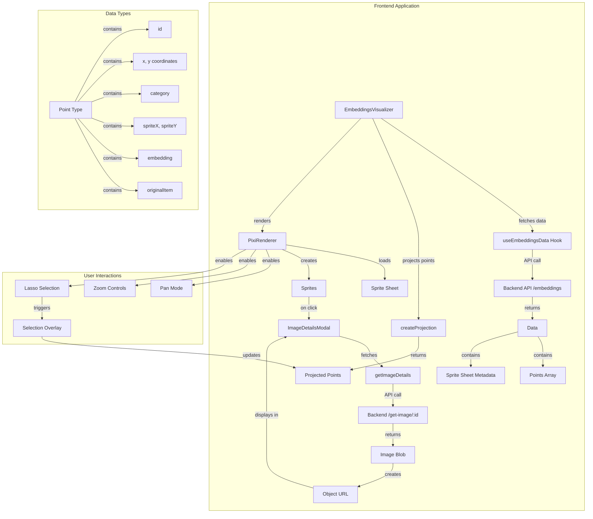

---

## How to Run and Deploy

### 1. Prerequisites

- [Node.js](https://nodejs.org/) (v16 or newer recommended)
- [npm](https://www.npmjs.com/) or [yarn](https://yarnpkg.com/)

### 2. Install dependencies

```bash
npm install
# or
yarn install
```

### 3. Set environment variables

Create a `.env` file in the project root (if not already present):

```
VITE_API_URL=http://localhost:8000
```

Adjust the URL to point to your backend API.

### 4. Run in development mode

```bash
npm run dev
# or
yarn dev
```

The app will be available at http://localhost:5173 (or as shown in your terminal).

### 5. Build for production

```bash
npm run build
# or
yarn build
```

The production-ready files will be in the `dist/` directory.

### 6. Preview the production build locally

```bash
npm run preview
# or
yarn preview
```

### 7. Deploy

- Upload the contents of the `dist/` directory to your static web server (e.g., Vercel, Netlify, GitHub Pages, or your own server).
- Make sure your backend API is accessible from the deployed frontend.